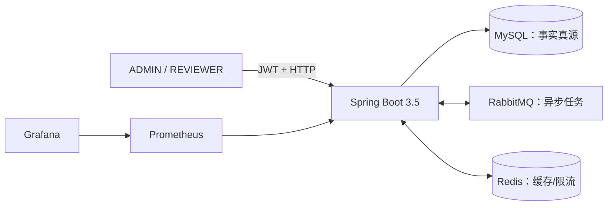
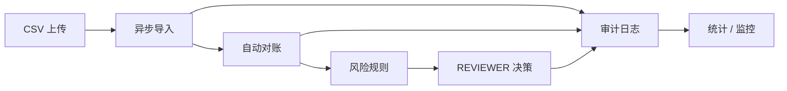

# FinGuard Core

FinGuard Core 是一个 Java 后端个人项目：围绕“交易导入 → 自动对账 → 风险识别 → 人工审核 → 审计/统计”构建完整业务闭环，并用真实 MySQL、RabbitMQ、Redis、JWT/HTTP、Prometheus/Grafana、Docker、Linux 部署、性能与安全证据验收。

当前状态：六周计划已完成，2026-10-09 补齐业务控制台：27 个业务操作、29 个场景配方。当前 Java 回归 404/404、Node 27/27，真实浏览器默认环境 44 项与配置变体 4 项通过；独立 Redis/MQ 演练通过。环境、分次运行及证据边界见 [控制台验收报告](docs/review/2026-10-09-complete-demo-console-acceptance.md)。原 Week 6 Day 7 的 2026-08-13 验收仍是历史基线。

> 这是工程学习与求职展示项目，不是生产银行系统，不提供真实资金处理、生产 SLA、合规认证或灾备承诺。

## 架构概览





核心取舍：MySQL 保持业务真源；Transactional Outbox 保证任务与待发事件同事务提交；消费者依靠行锁、终态幂等、唯一约束和手动 ACK；Redis 故障时统计回源、限流 fail-open；监控标签保持低基数且不包含敏感数据。

## 已实现能力

- 账户与人工交易 CRUD、软删除、稳定分页和数据库唯一约束；
- BCrypt 登录、两小时 HS256 JWT、无状态认证与 ADMIN/REVIEWER RBAC；
- 严格 UTF-8/RFC 4180 CSV 校验、SHA-256 文件幂等、原文件持久化；
- Transactional Outbox、RabbitMQ 异步导入/对账、5 秒/30 秒有限重试、DLQ；
- 精确/容差对账，`MATCHED/UNMATCHED/DUPLICATE/SUSPICIOUS` 结果；
- 大额、疑似重复、高频交易规则，审核任务和乐观锁决策；
- 不可变业务审计、MySQL 聚合统计、Redis JSON 缓存和固定窗口限流；
- OpenAPI/Swagger、非 root Java 17 镜像、六服务 Compose、GitHub Actions；
- Micrometer、Prometheus、Grafana 9 面板、Linux 不可变 SHA 部署与保留卷回滚；
- 真实 SQL/JMeter/Prometheus 性能证据、安全扫描和三类故障演练。

## 快速开始

要求：Java 17、Maven 3.9+、Docker Engine 与 Docker Compose。

### 运行隔离测试

要求 Docker Engine 可用。Spring 集成测试自动创建随机端口的 Testcontainers 中间件，不读取开发环境凭据，也不写入共享开发数据库。

```powershell
mvn.cmd -B -ntp clean test
```

### 启动六服务

```powershell
docker compose config --quiet
docker compose up -d --build --wait
docker compose ps
```

入口：

- 应用健康：`http://127.0.0.1:8080/actuator/health`
- Swagger UI：`http://127.0.0.1:8080/swagger-ui/index.html`
- Prometheus：`http://127.0.0.1:9090`
- Grafana：`http://127.0.0.1:3000`

安全停止并保留数据：

```powershell
docker compose down
Remove-Item Env:JWT_SECRET_BASE64
```

不要把真实密码/JWT 写入仓库或命令输出；日常停止不要执行 `docker compose down -v`。

### Day 7 隔离验收

先检查资源边界，再执行真实验收：

```powershell
powershell -NoProfile -ExecutionPolicy Bypass -File scripts/acceptance/tests/test-week6-day7-acceptance.ps1
powershell -NoProfile -ExecutionPolicy Bypass -File scripts/acceptance/invoke-week6-day7-acceptance.ps1 -DryRun
powershell -NoProfile -ExecutionPolicy Bypass -File scripts/acceptance/invoke-week6-day7-acceptance.ps1 -PreflightOnly
powershell -NoProfile -ExecutionPolicy Bypass -File scripts/acceptance/invoke-week6-day7-acceptance.ps1
```

真实模式只操作固定 `finguard-day7` Compose project 和隔离端口，运行结束在 `finally` 清理其容器、网络、卷与临时秘密。

## 验证证据

| 范围 | 已验证结果 | 证据 |
| --- | --- | --- |
| Java 回归 | 379/379，0 失败/错误/跳过 | [Week 6 最终复盘](docs/review/week6-review.md) |
| 六服务运行 | 6 healthy，Flyway V11，OpenAPI 18，Prometheus UP | [Week 6 最终复盘](docs/review/week6-review.md) |
| Linux 发布 | 完整 SHA GHCR 镜像、保留卷升级/回滚、ECS smoke | [Day 4 部署验收](docs/review/week6-day4-linux-deployment-acceptance.md) |
| 性能 | V11 默认审计分页使用复合索引扫描 | [性能报告](docs/PERFORMANCE_REPORT.md) |
| 安全 | 1 个 Low 修复；无已确认可复现 Critical/High 应用漏洞 | [安全摘要](docs/SECURITY_TEST_REPORT.md) |
| 故障恢复 | Redis、RabbitMQ 重试/DLQ、错误 MySQL 配置闭环 | [故障演练](docs/review/week6-day6-fault-drills.md) |

Day 5 优化后 ECS 外部 JMeter 复测全部返回 401，已判定为 Token 传递损坏，不能作为性能提升证据；本项目不声称生产吞吐、并发容量或 SLA。

## 文档索引

- [产品需求文档](docs/PRD.md)
- [架构说明](docs/ARCHITECTURE.md)
- [数据库与 ER](docs/DATABASE.md)
- [API 与权限/错误](docs/API.md)
- [交互式实时演示](http://127.0.0.1:8080/demo/index.html)（六服务栈全部 healthy 后可用）｜[演示手册：启动、账号与数据库写入说明](docs/DEMO.md)
- [部署与回滚](docs/DEPLOYMENT.md)
- [运维操作手册](docs/runbooks/README.md)
- [故障演练记录](docs/incidents/README.md)
- [架构决策记录](docs/adr/README.md)
- [监控与排障](docs/MONITORING.md)
- [性能报告](docs/PERFORMANCE_REPORT.md)
- [安全测试摘要](docs/SECURITY_TEST_REPORT.md)
- [面试笔记](docs/INTERVIEW_NOTES.md)
- [简历表述](docs/RESUME.md)
- [Week 6 最终复盘](docs/review/week6-review.md)
- [任务路线](TASKS.md) / [项目范围](PROJECT_BRIEF.md)

## 已知限制

- 单体、单机 Compose；没有 TLS 终止、水平扩容、多可用区或自动备份恢复演练。
- JWT 没有刷新和主动撤销；角色变化后的旧 Token 最长可能继续有效两小时。
- Redis 限流 fail-open 优先可用性，故障期间频控暂时失效。
- Outbox、审计和业务表未实现长期归档/分区策略。
- 安全验证不等于完整渗透或合规；供应链扫描数据需要每次发布刷新。
- 性能证据只覆盖审计默认分页，不可外推到全部业务或真实生产规模。

## 完整业务控制台

打开同源 `/demo/index.html`，使用 ADMIN 与 REVIEWER 两个会话。控制台覆盖账户、人工交易、任意 CSV、导入/对账历史和逐笔结果、审核上下文与决定、完整审计、全库统计及工程入口；逐步演示提供 29 个真实 API 场景。当前接口为 20 个路径、27 个业务操作。

先阅读 [覆盖清单](docs/DEMO_COVERAGE.md) 和 [本次验收](docs/review/2026-10-09-complete-demo-console-acceptance.md)。页面写入持久化数据库，刷新须重新登录。

```powershell
npm.cmd ci --prefix scripts/demo
node scripts/demo/node_modules/playwright/cli.js install chromium
powershell -NoProfile -File scripts/demo/invoke-console-acceptance.ps1 -PreflightOnly
powershell -NoProfile -File scripts/demo/invoke-console-acceptance.ps1
# 可选：本机已有 Chrome，且 JRE 已缓存时使用验收专用打包路径
powershell -NoProfile -File scripts/demo/invoke-console-acceptance.ps1 -UseCachedRuntime -BrowserChannel chrome
# 另建独立 finguard-day6 栈，运行已有 Redis / MQ 演练；结束清理自有资源
powershell -NoProfile -File scripts/demo/invoke-console-acceptance.ps1 -UseCachedRuntime -EngineeringOnly
```

默认业务验收只操作 `finguard-console`、临时随机凭据和独立端口，清理前核对 labels 与完整容器 ID。工程模式另外使用 `finguard-day6`；任何资源或端口冲突会停止。两个模式按顺序运行。缓存打包路径核对 Maven Java 17，记录本机 JRE digest，不代替生产 Dockerfile 的发布构建验证。
