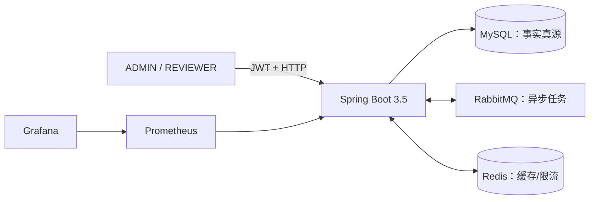
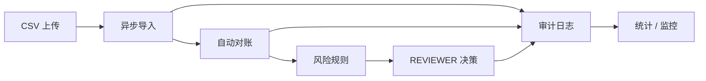

# FinGuard Core

FinGuard Core 是一个 Java 后端个人项目：围绕“交易导入 → 自动对账 → 风险识别 → 人工审核 → 审计/统计”构建完整业务闭环，并用真实 MySQL、RabbitMQ、Redis、JWT/HTTP、Prometheus/Grafana、Docker、Linux 部署、性能与安全证据验收。

当前状态：六周计划和 Week 6 Day 7 已完成。2026-08-13 新鲜基线为 Java 17 `mvn clean test` 379/379 通过；独立六服务环境全部 healthy，Flyway V11、OpenAPI 18 路径、Prometheus target `UP`，真实业务闭环和保留卷重启恢复通过。

> 这是工程学习与求职展示项目，不是生产银行系统，不提供真实资金处理、生产 SLA、合规认证或灾备承诺。

## 架构概览





核心取舍：MySQL 保持业务真源；Transactional Outbox 保证任务与待发事件同事务提交；消费者依靠行锁、终态幂等、唯一约束和手动 ACK；Redis 故障时统计回源、限流 fail-open；监控标签保持低基数且不包含敏感数据。

## 已实现能力

- 账户与人工交易 CRUD、软删除、稳定分页和数据库唯一约束；
- BCrypt 登录、两小时 HS256 JWT、无状态认证与 ADMIN/REVIEWER RBAC；
- 严格 UTF-8/RFC 4180 CSV 校验、SHA-256 文件幂等、原文件持久化；
- Transactional Outbox、RabbitMQ 异步导入/对账、5 秒/30 秒有限重试、DLQ；
- 精确/容差对账，`MATCHED/UNMATCHED/DUPLICATE/SUSPICIOUS` 结果；
- 大额、疑似重复、高频交易规则，审核任务和乐观锁决策；
- 不可变业务审计、MySQL 聚合统计、Redis JSON 缓存和固定窗口限流；
- OpenAPI/Swagger、非 root Java 17 镜像、六服务 Compose、GitHub Actions；
- Micrometer、Prometheus、Grafana 9 面板、Linux 不可变 SHA 部署与保留卷回滚；
- 真实 SQL/JMeter/Prometheus 性能证据、安全扫描和三类故障演练。

## 快速开始

要求：Java 17、Maven 3.9+、Docker Engine 与 Docker Compose。

### 只启动依赖并运行测试

准备 `.env` 中的本机随机密码，并只在当前会话生成 JWT 密钥：

```powershell
Copy-Item .env.example .env
$jwtBytes = New-Object byte[] 32
$rng = [System.Security.Cryptography.RandomNumberGenerator]::Create()
try { $rng.GetBytes($jwtBytes) } finally { $rng.Dispose() }
$env:JWT_SECRET_BASE64 = [Convert]::ToBase64String($jwtBytes)
docker compose up -d --wait mysql rabbitmq redis
mvn clean test
```

### 启动六服务

```powershell
docker compose config --quiet
docker compose up -d --build --wait
docker compose ps
```

入口：

- 应用健康：`http://127.0.0.1:8080/actuator/health`
- Swagger UI：`http://127.0.0.1:8080/swagger-ui/index.html`
- Prometheus：`http://127.0.0.1:9090`
- Grafana：`http://127.0.0.1:3000`

安全停止并保留数据：

```powershell
docker compose down
Remove-Item Env:JWT_SECRET_BASE64
```

不要把真实密码/JWT 写入仓库或命令输出；日常停止不要执行 `docker compose down -v`。

### Day 7 隔离验收

先检查资源边界，再执行真实验收：

```powershell
powershell -NoProfile -ExecutionPolicy Bypass -File scripts/acceptance/tests/test-week6-day7-acceptance.ps1
powershell -NoProfile -ExecutionPolicy Bypass -File scripts/acceptance/invoke-week6-day7-acceptance.ps1 -DryRun
powershell -NoProfile -ExecutionPolicy Bypass -File scripts/acceptance/invoke-week6-day7-acceptance.ps1 -PreflightOnly
powershell -NoProfile -ExecutionPolicy Bypass -File scripts/acceptance/invoke-week6-day7-acceptance.ps1
```

真实模式只操作固定 `finguard-day7` Compose project 和隔离端口，运行结束在 `finally` 清理其容器、网络、卷与临时秘密。

## 验证证据

| 范围 | 已验证结果 | 证据 |
| --- | --- | --- |
| Java 回归 | 379/379，0 失败/错误/跳过 | [Week 6 最终复盘](docs/review/week6-review.md) |
| 六服务运行 | 6 healthy，Flyway V11，OpenAPI 18，Prometheus UP | [Week 6 最终复盘](docs/review/week6-review.md) |
| Linux 发布 | 完整 SHA GHCR 镜像、保留卷升级/回滚、ECS smoke | [Day 4 部署验收](docs/review/week6-day4-linux-deployment-acceptance.md) |
| 性能 | V11 默认审计分页使用复合索引扫描 | [性能报告](docs/PERFORMANCE_REPORT.md) |
| 安全 | 1 个 Low 修复；无已确认可复现 Critical/High 应用漏洞 | [安全摘要](docs/SECURITY_TEST_REPORT.md) |
| 故障恢复 | Redis、RabbitMQ 重试/DLQ、错误 MySQL 配置闭环 | [故障演练](docs/review/week6-day6-fault-drills.md) |

Day 5 优化后 ECS 外部 JMeter 复测全部返回 401，已判定为 Token 传递损坏，不能作为性能提升证据；本项目不声称生产吞吐、并发容量或 SLA。

## 文档索引

- [产品需求文档](docs/PRD.md)
- [架构说明](docs/ARCHITECTURE.md)
- [数据库与 ER](docs/DATABASE.md)
- [API 与权限/错误](docs/API.md)
- [演示手册](docs/DEMO.md)
- [部署与回滚](docs/DEPLOYMENT.md)
- [运维操作手册](docs/runbooks/README.md)
- [故障演练记录](docs/incidents/README.md)
- [架构决策记录](docs/adr/README.md)
- [监控与排障](docs/MONITORING.md)
- [性能报告](docs/PERFORMANCE_REPORT.md)
- [安全测试摘要](docs/SECURITY_TEST_REPORT.md)
- [面试笔记](docs/INTERVIEW_NOTES.md)
- [简历表述](docs/RESUME.md)
- [Week 6 最终复盘](docs/review/week6-review.md)
- [任务路线](TASKS.md) / [项目范围](PROJECT_BRIEF.md)

## 已知限制

- 单体、单机 Compose；没有 TLS 终止、水平扩容、多可用区或自动备份恢复演练。
- JWT 没有刷新和主动撤销；角色变化后的旧 Token 最长可能继续有效两小时。
- Redis 限流 fail-open 优先可用性，故障期间频控暂时失效。
- Outbox、审计和业务表未实现长期归档/分区策略。
- 安全验证不等于完整渗透或合规；供应链扫描数据需要每次发布刷新。
- 性能证据只覆盖审计默认分页，不可外推到全部业务或真实生产规模。
