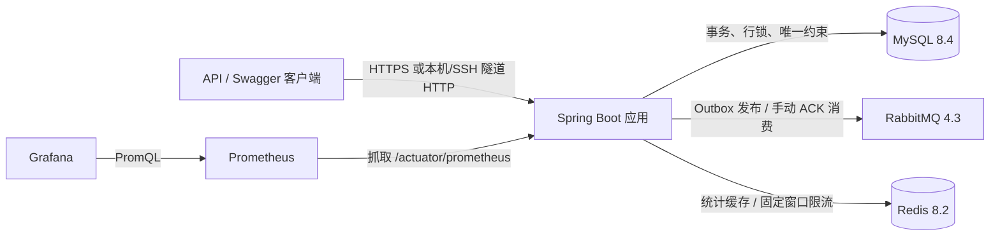
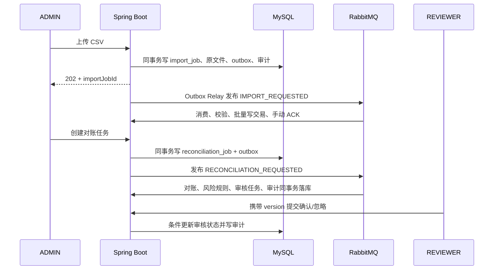

# FinGuard Core 架构说明

## 1. 系统定位与边界

FinGuard Core 是一个用于 Java 后端工程训练的个人项目：把账户、交易、CSV 异步导入、自动对账、风险命中、人工审核、审计和统计串成可运行闭环，并补齐容器、监控、部署、性能和安全验证。它不是银行核心系统，也不承诺生产 SLA、灾备等级或合规认证。

应用保持单体边界，以 MySQL 为业务事实真源；RabbitMQ 负责异步传递，Redis 只承载缓存和限流，Prometheus/Grafana 只负责观测。任何缓存或消息都不能替代数据库中的任务状态、幂等键和审计事实。

## 2. 运行架构

本地 Compose 可发布六个服务的回环端口；Linux Compose 不发布 MySQL、RabbitMQ、Redis 宿主机端口，应用、Prometheus、Grafana 只绑定 `127.0.0.1`。外部访问应通过 SSH 隧道或等价的受控入口。

## 3. 核心业务流

## 4. 一致性与可靠性

- HTTP 写操作由 Service 事务包围；外部解析、密码计算和 JWT 签发不无理由占用数据库事务。
- 导入与对账受理采用 Transactional Outbox，业务任务和待发布事件同事务提交。
- 消费者使用任务行锁、终态检查、唯一约束和提交后 ACK，应对重复投递、并发消费和 ACK 丢失。
- 失败分为业务失败、可重试系统失败和非法消息；系统失败最多经过 5 秒、30 秒两级延迟，耗尽后进入独立 DLQ。
- 审核决策采用 `id + PENDING + version` 条件更新，区分不存在、终态重复和版本冲突。
- Redis 故障时统计回源 MySQL、限流 fail-open；这保住可用性，但会暂时削弱登录/上传频控，健康检查仍暴露依赖异常。

## 5. 安全边界

- 登录使用 BCrypt，签发两小时 HS256 JWT；密钥必须由运行环境提供，Base64 解码后至少 32 字节。
- Spring Security 无状态校验 Bearer Token；ADMIN 负责业务写入和审计查询，REVIEWER 负责业务读取与审核决策。
- 匿名仅可访问登录、健康、Prometheus 和 OpenAPI/Swagger；Actuator 只暴露 `health,prometheus`。
- CSV 受 5 MiB、10,000 行、严格 UTF-8、RFC 4180 与字段/领域校验约束。
- 审计摘要、消息头和指标标签使用固定低基数值，不记录密码、JWT、CSV 原文、SQL、堆栈或自由文本异常。

## 6. 可观测性

应用暴露 HTTP/JVM/HikariCP 默认指标和三组业务指标：导入终态 Counter、对账处理 Timer、消费者失败 Counter。Prometheus 保存时间序列，Grafana 自动装载数据源和 9 个面板。业务 ID、用户名、文件名和异常文本不得进入标签。

## 7. 代码组织

`src/main/java/com/finguard/core` 按账户、交易、认证、导入、对账、消息、风险、审核、审计、统计、限流和观测拆包。Controller 负责协议与可信身份提取，Service 负责事务和业务规则，Mapper 负责参数化 SQL，Flyway 负责不可变模式演进。

相关文档：[数据库](DATABASE.md)、[API](API.md)、[部署](DEPLOYMENT.md)、[监控](MONITORING.md)。
