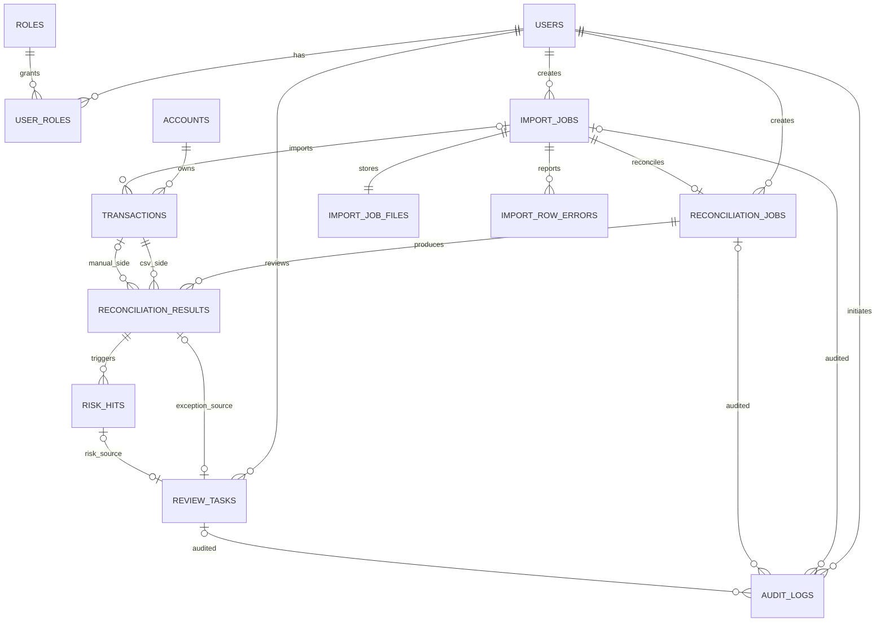

# FinGuard Core 数据库说明

## 1. 迁移原则

数据库由 Flyway 管理，当前最新版本为 V11。已经应用的迁移不可编辑；结构变更只能新增下一版本。应用启动时 Flyway 先校验再迁移，失败会阻止应用在不确定结构上运行。

| 版本 | 内容 |
| --- | --- |
| V1 | 账户、交易、软删除与业务唯一键 |
| V2 | 用户、角色、用户角色 |
| V3 | 默认交易分页索引 |
| V4–V5 | 导入任务、行错误、交易与导入关联 |
| V6 | 对账任务和逐笔结果 |
| V7 | 原始导入文件、Transactional Outbox |
| V8–V9 | 风险命中、审核任务和乐观锁版本 |
| V10 | 不可变业务审计日志 |
| V11 | 审计默认分页索引 |

## 2. 关系图

`outbox_events` 以 `event_type + aggregate_id` 唯一定位导入或对账事件，逻辑关联聚合而不使用多态外键。

## 3. 关键不变量

- 账户号唯一；账户和交易软删除后仍保留历史编号。
- 交易以 `(account_id, source, external_transaction_no)` 唯一；`MANUAL` 不得关联导入任务，`CSV_IMPORT` 必须关联导入任务。
- 文件 SHA-256 在 `import_jobs.file_hash` 唯一，保证相同原始文件只受理一次。
- 一个导入任务最多创建一个对账任务；每个对账任务对每条 CSV 交易最多产生一个结果。
- 风险命中以 `(reconciliation_result_id, rule_code)` 唯一；审核任务只允许恰好一种来源。
- 审核终态必须有审核人和时间，`PENDING` 必须是 `version=0`；首次决策后为 `version=1`。
- 审计事件白名单、行为与目标形状、结果和唯一键都由 CHECK/外键/唯一约束保护，Mapper 不提供更新或删除入口。

## 4. 查询与索引

所有列表使用稳定排序，通常由时间列和 `id` 共同消除同毫秒歧义。主要访问路径包括：

- `idx_transactions_account_time` 与 V3 默认交易分页索引；
- 导入错误 `(import_job_id, csv_row_number, id)`；
- 对账结果 `(reconciliation_job_id, result_type, csv_transaction_id, id)`；
- Outbox 到期事件 `(status, next_attempt_at, id)`；
- 审核状态与来源分页索引；
- V11 `idx_audit_logs_created_id(created_at DESC, id DESC)`。

Day 5 在 50,002 条审计数据上用真实 `EXPLAIN ANALYZE` 证明默认查询由全表扫描/排序变为按 V11 索引取 20 行；详细限制见[性能报告](PERFORMANCE_REPORT.md)。

## 5. 数据生命周期与恢复边界

项目没有实现自动归档、法定保留期、跨地域备份或在线模式回滚。应用镜像回滚不会回滚 Flyway 或业务数据；部署前必须先判断迁移的向后兼容性。日常停止不得执行 `docker compose down -v`，隔离验收仅能删除其固定项目名拥有的卷。
