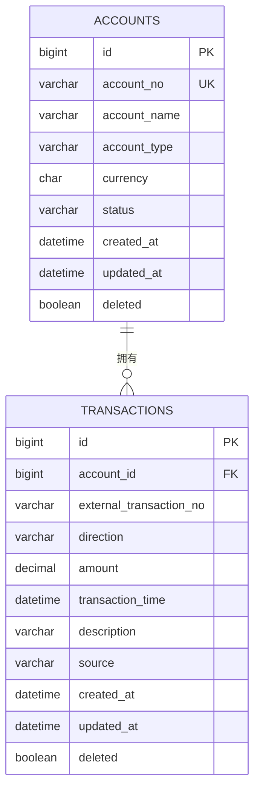

# Day 2：账户与交易需求及数据模型

## 1. 文档目标

本文档锁定 FinGuard Core 第一周账户与交易模块的最小业务范围，为后续数据库迁移、账户 CRUD 和交易 CRUD 提供统一依据。

Day 2 只完成需求分析和数据模型设计，不创建数据库、不引入 MyBatis-Plus 或 Flyway，也不实现 Controller、Service、Mapper。

## 2. 业务范围

### 2.1 账户

账户是用于归集、管理、统计和对账交易的资金容器或业务账户，不是登录用户，也不是资金所有者。

当前支持：

- 银行账户；
- 现金账户；
- 支付平台账户。

### 2.2 交易

交易是某个账户中已经发生或录入的一笔资金变动记录。一笔交易必须属于一个账户，一个账户可以没有交易，也可以拥有多笔交易。

```text
Account 1 ────── 0..N Transaction
```

当前版本采用“正数金额 + 收支方向”：

```text
INCOME  → +amount
EXPENSE → -amount
```

数据库中的 `amount` 永远大于零，只有统计时才根据 `direction` 计算带符号结果。

## 3. 账户业务规则

### 3.1 账户编号

- `accountNo` 必填；
- 去除首尾空格后不能为空；
- 统一转换为大写；
- 长度为 3～64；
- 只允许大写字母、数字、短横线和下划线；
- 创建后不可修改；
- 全局唯一；
- 账户软删除后，原编号也不能重新使用。

建议格式：

```regex
^[A-Z0-9][A-Z0-9_-]{2,63}$
```

`accountNo` 是 FinGuard 内部业务编号，不直接保存完整银行卡号等敏感信息。

### 3.2 账户名称

- `accountName` 必填；
- 去除首尾空格后不能为空；
- 长度为 1～100；
- 允许中文；
- 允许不同账户使用相同名称；
- 创建后允许修改。

账户名称只用于展示，账户编号才是账户的业务身份。

### 3.3 账户类型

当前只支持：

```text
BANK
CASH
PAYMENT_PLATFORM
```

- `accountType` 必填；
- 创建后不可修改；
- 当前只用于分类、查询和展示；
- 当前不根据账户类型执行不同业务逻辑。

### 3.4 币种

- 当前版本固定为 `CNY`；
- 创建账户时由系统自动设置；
- 创建接口不接收调用者传入的币种；
- 创建后不可修改；
- 当前版本不实现汇率和多币种转换。

### 3.5 账户状态

当前只支持：

```text
ACTIVE
DISABLED
```

- 新账户默认是 `ACTIVE`；
- `ACTIVE` 账户可以创建和导入交易；
- `DISABLED` 账户可以查询账户及历史交易，也可以修改账户名称；
- `DISABLED` 账户不能创建或导入新交易；
- 允许 `ACTIVE → DISABLED`；
- 允许 `DISABLED → ACTIVE`；
- 重复设置相同状态按幂等成功处理。

### 3.6 账户删除

- 账户使用软删除；
- 只有 `DISABLED` 且从未产生过交易的账户可以删除；
- “从未产生过交易”必须检查该账户的全部交易记录，包括已经软删除的交易；
- 只要曾经存在任何交易，账户就不能删除，只能保持禁用；
- 删除后的账户默认不出现在普通查询中；
- 删除后的账户不能重新启用；
- 当前版本不提供账户恢复功能；
- 删除后的账户编号不能再次使用。

### 3.7 账户余额

第一版不在 `accounts` 表保存 `balance`、`current_balance` 或 `available_balance`。余额变化由交易计算，避免余额字段与交易事实形成两个可能不一致的数据源。

## 4. 交易业务规则

### 4.1 所属账户

- `accountId` 必填；
- 账户必须存在且未删除；
- 创建交易时账户必须是 `ACTIVE`；
- 账户禁用后，历史交易仍然可以查询。

### 4.2 外部流水号

- `externalTransactionNo` 必填；
- 去除首尾空格后不能为空；
- 长度为 1～128；
- 创建后不可修改；
- 保留原始大小写并按大小写敏感方式比较；
- 同一账户、同一来源内唯一；
- 同一账户的 `MANUAL` 和 `CSV_IMPORT` 记录可以使用相同流水号，以支持两侧对账；
- 不同账户之间可以使用相同流水号；
- 交易软删除后，原流水号也不能在同一账户、同一来源内重新使用。

唯一性范围：

```text
(account_id, source, external_transaction_no)
```

### 4.3 收支方向

当前只支持：

```text
INCOME
EXPENSE
```

- `direction` 必填；
- 数据库只保存正数金额；
- 统计时根据方向计算资金净变化。

### 4.4 金额

- Java 使用 `BigDecimal`；
- MySQL 使用 `DECIMAL(19,2)`；
- 金额必填且必须大于 `0.00`；
- 最多允许两位小数；
- 超过两位小数时拒绝请求，不自动舍入；
- 保存时规范为两位小数；
- 禁止使用 `double` 保存金额。

### 4.5 交易时间

- `transactionTime` 必填；
- 使用固定业务时区 `Asia/Shanghai`；
- 可以录入历史交易；
- 最晚允许为当前时间之后五分钟；
- 数据库保留毫秒精度。

建议映射：

```text
Java：LocalDateTime
MySQL：DATETIME(3)
```

### 4.6 交易来源

当前只支持：

```text
MANUAL
CSV_IMPORT
```

- 人工创建接口由系统设置为 `MANUAL`，代表内部待对账交易；
- CSV 导入流程由系统设置为 `CSV_IMPORT`，代表外部实际流水；
- 来源不由客户端自由填写；
- 创建后不可修改。

在当前六周简化模型中，`source` 同时表示数据进入方式和对账数据侧。自动对账允许同一账户、同一流水号分别存在一条 `MANUAL` 记录和一条 `CSV_IMPORT` 记录，然后比较金额和交易时间。

### 4.7 交易描述

- `description` 可为空；
- 非空时去除首尾空格；
- 最大长度为 255；
- 允许中文；
- 允许修改；
- 空字符串统一转换为 `null`。

### 4.8 交易修改

尚未参与对账的 `MANUAL` 交易允许修改：

- `direction`；
- `amount`；
- `transactionTime`；
- `description`。

以下字段不可修改：

- `id`；
- `accountId`；
- `externalTransactionNo`；
- `source`；
- `createdAt`。

`CSV_IMPORT` 交易不允许人工修改核心字段。交易产生对账结果后，不再允许修改核心字段。

### 4.9 交易删除

- 交易使用软删除；
- 只有尚未参与对账的 `MANUAL` 交易可以删除；
- 删除时所属账户必须为 `ACTIVE`；
- `CSV_IMPORT` 交易不能人工删除；
- 已参与对账的交易不能删除；
- 重复删除按幂等成功处理；
- 软删除交易默认不参与普通查询、统计和后续对账；
- 软删除后原外部流水号不能重新使用。

## 5. 交易创建校验流程

```text
请求字段非空和格式校验
  → 方向合法性校验
  → 金额精度和范围校验
  → 交易时间校验
  → 查询账户
  → 校验账户状态
  → 根据入口确定 source
  → 按账户、来源和流水号进行重复预检查
  → 尝试插入交易
      ├─ 成功：返回创建结果
      └─ 唯一约束冲突：转换为“交易已存在”业务错误
```

Service 层的重复预检查用于改善错误提示，数据库唯一约束用于保证并发场景下的最终正确性。

## 6. 规则责任边界

### 6.1 Service 负责

- 对输入字符串执行去除首尾空格等标准化；
- 将账户编号转换为大写并检查格式、长度；
- 检查金额的小数位数，拒绝超过两位小数的输入；
- 检查交易时间不能明显位于未来；
- 根据调用入口设置交易 `source`；
- 检查账户存在、未删除且状态为 `ACTIVE`；
- 执行账户编号和交易流水号的重复预检查；
- 校验账户和交易字段是否允许修改；
- 校验账户启用、禁用和软删除规则；
- 删除账户前查询包括软删除交易在内的全部历史记录；
- 修改或删除交易前检查是否已经产生对账结果；
- 捕获数据库约束异常并转换成明确的业务错误。

### 6.2 数据库负责兜底

- 主键、非空约束和外键；
- 账户编号最终唯一性；
- 账户、来源和外部流水号的组合唯一性；
- 金额精度以及金额必须大于零；
- 账户类型、币种、账户状态、交易方向、交易来源和软删除标记的值域；
- 外部流水号按大小写敏感方式比较；
- 禁止物理删除仍然被交易引用的账户。

Service 的预检查不能替代数据库约束。数据库约束负责并发和绕过应用写入时的最终正确性，Service 负责业务语义、状态判断以及友好错误信息。

## 7. 第一版 ER 图



## 8. 表结构设计

### 8.1 `accounts`

| 字段 | MySQL 类型 | Java 类型 | 约束 |
|---|---|---|---|
| `id` | `BIGINT` | `Long` | 主键、自增 |
| `account_no` | `VARCHAR(64)` | `String` | 非空、唯一 |
| `account_name` | `VARCHAR(100)` | `String` | 非空 |
| `account_type` | `VARCHAR(32)` | `AccountType` | 非空 |
| `currency` | `CHAR(3)` | `String` | 非空，默认 `CNY` |
| `status` | `VARCHAR(16)` | `AccountStatus` | 非空，默认 `ACTIVE` |
| `created_at` | `DATETIME(3)` | `LocalDateTime` | 非空 |
| `updated_at` | `DATETIME(3)` | `LocalDateTime` | 非空 |
| `deleted` | `TINYINT(1)` | `Boolean` | 非空，默认 `0` |

必要约束：

```text
PRIMARY KEY (id)
UNIQUE (account_no)
CHECK (account_type IN ('BANK', 'CASH', 'PAYMENT_PLATFORM'))
CHECK (currency = 'CNY')
CHECK (status IN ('ACTIVE', 'DISABLED'))
CHECK (deleted IN (0, 1))
CHECK (deleted = 0 OR status = 'DISABLED')
```

建议名称：

```text
pk_accounts
uk_accounts_account_no
chk_accounts_type
chk_accounts_currency
chk_accounts_status
chk_accounts_deleted
chk_accounts_deleted_status
```

### 8.2 `transactions`

| 字段 | MySQL 类型 | Java 类型 | 约束 |
|---|---|---|---|
| `id` | `BIGINT` | `Long` | 主键、自增 |
| `account_id` | `BIGINT` | `Long` | 非空、外键 |
| `external_transaction_no` | `VARCHAR(128) COLLATE utf8mb4_bin` | `String` | 非空、区分大小写 |
| `direction` | `VARCHAR(16)` | `TransactionDirection` | 非空 |
| `amount` | `DECIMAL(19,2)` | `BigDecimal` | 非空、大于零 |
| `transaction_time` | `DATETIME(3)` | `LocalDateTime` | 非空 |
| `description` | `VARCHAR(255)` | `String` | 可空 |
| `source` | `VARCHAR(16)` | `TransactionSource` | 非空 |
| `created_at` | `DATETIME(3)` | `LocalDateTime` | 非空 |
| `updated_at` | `DATETIME(3)` | `LocalDateTime` | 非空 |
| `deleted` | `TINYINT(1)` | `Boolean` | 非空，默认 `0` |

必要约束：

```text
PRIMARY KEY (id)
FOREIGN KEY (account_id) REFERENCES accounts(id) ON DELETE RESTRICT
UNIQUE (account_id, source, external_transaction_no)
CHECK (amount > 0)
CHECK (direction IN ('INCOME', 'EXPENSE'))
CHECK (source IN ('MANUAL', 'CSV_IMPORT'))
CHECK (deleted IN (0, 1))
```

建议名称：

```text
pk_transactions
fk_transactions_account
uk_transactions_account_source_external_no
chk_transactions_amount_positive
chk_transactions_direction
chk_transactions_source
chk_transactions_deleted
```

第一版查询索引：

```text
idx_transactions_account_time(account_id, transaction_time)
```

`external_transaction_no` 使用 `utf8mb4_bin` 排序规则，确保按大小写敏感方式比较。软删除字段不加入唯一约束，确保流水号不能在软删除后于同一账户、同一来源内重新使用。

## 9. 验收场景

### 9.1 账户

1. 使用合法编号和名称创建账户成功，状态默认为 `ACTIVE`，币种默认为 `CNY`；
2. 账户编号为空、过长或格式错误时创建失败；
3. 重复账户编号创建失败；
4. 账户名称允许重复；
5. 账户编号和账户类型创建后不能修改；
6. 账户名称允许修改；
7. 禁用账户后不能创建新交易；
8. 禁用账户后仍能查询历史交易；
9. 重复禁用或重复启用按幂等成功处理；
10. `ACTIVE` 账户不能直接删除；
11. `DISABLED` 且从未产生交易的账户可以软删除；
12. 已经产生任何交易的账户不能删除，包括交易已经软删除的情况；
13. 被删除账户默认查询不到；
14. 被删除账户的编号不能重新使用。

### 9.2 交易

1. 向有效账户创建收入交易成功；
2. 向有效账户创建支出交易成功；
3. 账户不存在或已禁用时创建失败；
4. 金额为零、负数或超过两位小数时创建失败；
5. 交易时间明显位于未来时创建失败；
6. 同一账户、同一来源使用重复外部流水号时创建失败；
7. 同一账户的人工交易和 CSV 流水可以使用相同外部流水号，并能作为对账候选；
8. 不同账户使用相同外部流水号时创建成功；
9. 并发创建同一账户、同一来源、同一流水号的交易时，数据库唯一约束保证只有一条成功；
10. 尚未对账的人工交易允许修改可变字段；
11. 交易所属账户、外部流水号和来源不能修改；
12. CSV 导入交易不能人工修改核心字段；
13. 尚未对账的人工交易允许软删除；
14. CSV 导入交易和已对账交易不能删除；
15. 软删除交易不参与普通查询、统计和后续对账；
16. 交易软删除后，原外部流水号不能在同一账户、同一来源内重新使用。

## 10. 当前不实现

- 用户与账户的所有权关系；
- 账户余额冗余字段；
- 多币种和汇率换算；
- 交易退款、冲正和手续费拆分；
- 对账状态和审核状态直接存放在交易表；
- 导入任务、对账记录、审核任务等后续业务表；
- Controller、Service、Mapper 和数据库迁移。

这些内容只有在后续对应模块开始时才能通过新的、小范围迁移加入。

后续扩展约定已经锁定：

```text
transactions.import_job_id
reconciliation_records.internal_transaction_id
reconciliation_records.external_transaction_id
reconciliation_records.result
```

其中 `internal_transaction_id` 关联 `MANUAL` 交易，`external_transaction_id` 关联 `CSV_IMPORT` 交易。上述字段和表在对应模块开始前不提前创建。

## 11. Day 2 验收清单

- [x] 明确账户和交易的业务含义；
- [x] 明确账户与交易的一对多关系；
- [x] 锁定账户业务规则；
- [x] 锁定交易业务规则；
- [x] 绘制第一版 ER 图；
- [x] 确定账户表和交易表字段；
- [x] 确定主键、外键、唯一约束和第一版查询索引；
- [x] 写出正常、异常和并发验收场景；
- [x] 未提前实现 Day 3 及后续代码。
- [x] 完成 Day 2 设计文档的 Git 提交。
