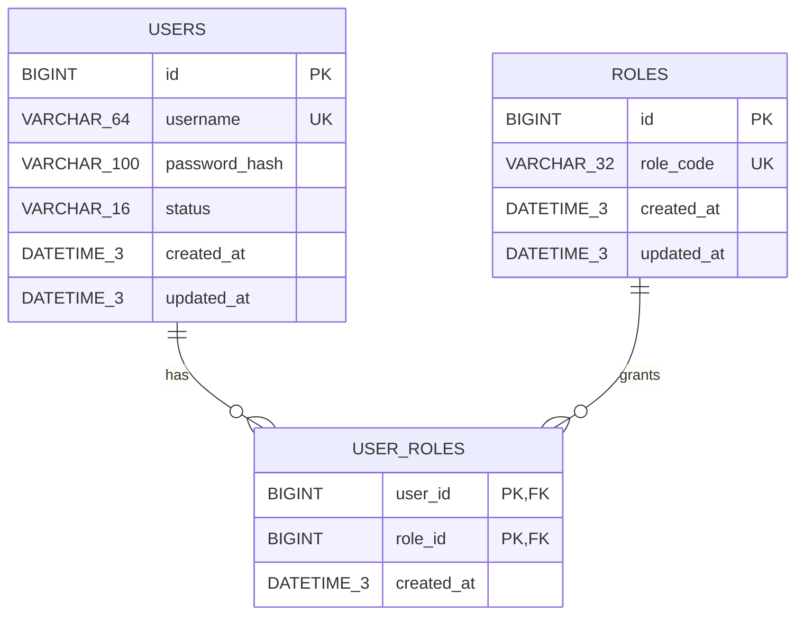

# Week 2 Day 1：认证与授权设计

## 1. 文档目标

本文档锁定 FinGuard Core 第二周最小认证与授权闭环，作为 Day 2～Day 5 数据库迁移、登录、JWT 校验和 RBAC 权限实现的唯一设计依据。

Day 1 只完成需求、接口、数据模型、权限和测试设计，不修改 `pom.xml`、Java 代码、配置文件或数据库迁移。

## 2. 业务目标与范围

账户、交易以及后续的导入、对账和异常审核都属于敏感业务数据。系统必须先确认调用者身份，再根据角色决定其能否执行当前操作，不能继续允许匿名访问。

本周实现：

- 用户名、密码登录；
- BCrypt 密码校验；
- 两小时有效的 JWT Access Token；
- `ADMIN`、`REVIEWER` 两种角色；
- 对现有账户和交易接口进行基于角色的访问控制；
- 与现有 `ApiErrorResponse` 结构一致的 `400`、`401`、`403` 响应。

本周不实现：

- 用户注册、密码找回和用户管理接口；
- Refresh Token、Token 黑名单、主动登出；
- OAuth 2.0 授权服务器、OIDC、第三方登录；
- Redis 登录限流；
- 前端登录页面；
- 多租户和复杂动态权限。

Redis 登录限流记录为后续安全增强，本周不能因此跨越 Week 2 边界。

## 3. 核心概念与请求流

### 3.1 认证与授权

- 认证（Authentication）回答“你是谁”，例如验证用户名、密码或 JWT。
- 授权（Authorization）回答“你能做什么”，例如只有 `ADMIN` 可以创建账户。
- JWT 是服务器签发的身份凭证，不是权限规则本身。
- RBAC 将权限授予角色，再将角色绑定给用户，避免在业务代码中零散判断用户名。

### 3.2 Spring Security 中的职责

- `SecurityFilterChain`：在请求进入 Controller 前依次执行安全过滤器和授权规则。
- `Authentication`：表示当前已经验证的身份及其权限。
- `SecurityContext`：保存当前请求使用的 `Authentication`。
- `GrantedAuthority`：表示角色或权限；本项目把角色映射为 `ROLE_ADMIN`、`ROLE_REVIEWER`。
- Resource Server：从 `Authorization: Bearer <token>` 读取并验证 JWT，成功后建立当前身份。

### 3.3 从登录到访问业务接口

```text
用户名、密码
  → 校验请求格式
  → 按规范化用户名查询用户和角色
  → BCrypt 校验密码并检查 ACTIVE 状态
  → 签发两小时 JWT
  → 客户端携带 Authorization: Bearer <token>
  → Resource Server 验证签名、签发方和有效期
  → 将 roles 转换为 GrantedAuthority
  → SecurityFilterChain 检查接口权限
  → 允许进入 Controller，或返回 401 / 403
```

### 3.4 `400`、`401`、`403` 的边界

| 状态 | 含义 | 示例 |
|---|---|---|
| `400 Bad Request` | 请求格式或字段不合法，尚未进入身份校验 | 用户名为空、缺少密码、JSON 无法解析 |
| `401 Unauthorized` | 没有建立合法身份 | 密码错误、用户被禁用、无 Token、Token 过期或被篡改 |
| `403 Forbidden` | 身份合法，但角色不允许当前操作 | `REVIEWER` 创建、修改或删除账户 |

## 4. 登录接口契约

### 4.1 请求

```http
POST /api/auth/login
Content-Type: application/json
```

```json
{
  "username": "admin",
  "password": "local-secret"
}
```

字段规则：

| 字段 | 规则 |
|---|---|
| `username` | 必填；`trim + lowercase` 后长度为 3～64；只使用规范化值查询 |
| `password` | 必填；不 `trim`、不修改大小写；UTF-8 编码后为 1～72 字节，与 BCrypt 输入边界一致 |

密码是区分大小写的秘密，服务端不能记录明文密码、密码哈希或完整登录请求体。

### 4.2 成功响应

登录成功返回 `200 OK`：

```json
{
  "accessToken": "<jwt>",
  "tokenType": "Bearer",
  "expiresInSeconds": 7200
}
```

客户端访问受保护接口时使用：

```http
Authorization: Bearer <jwt>
```

### 4.3 失败响应

登录请求字段不合法返回 `400`，沿用现有错误结构：

```json
{
  "timestamp": "2026-07-25T08:00:00Z",
  "status": 400,
  "code": "VALIDATION_FAILED",
  "message": "Request validation failed",
  "path": "/api/auth/login",
  "fieldErrors": []
}
```

用户名不存在、密码错误和用户状态为 `DISABLED` 必须返回完全相同的 `401`：

```json
{
  "timestamp": "2026-07-25T08:00:00Z",
  "status": 401,
  "code": "INVALID_CREDENTIALS",
  "message": "Invalid username or password",
  "path": "/api/auth/login",
  "fieldErrors": []
}
```

统一提示可以避免调用者根据响应判断某个用户名是否存在。密码比较使用 BCrypt，即使用户不存在，也应避免明显不同的快速失败路径。

受保护资源的认证失败统一使用：

- `401 + AUTHENTICATION_REQUIRED`：没有 Bearer Token；
- `401 + INVALID_TOKEN`：Token 格式错误、签名错误、签发方错误或已经过期；
- `403 + ACCESS_DENIED`：身份合法但权限不足。

这些错误继续使用 `ApiErrorResponse`，且 `fieldErrors` 为空数组。

## 5. JWT 决策

### 5.1 算法和密钥

- 当前模块化单体使用 `HS256`；
- 密钥至少为 256 bit；
- 使用 Base64 编码的环境变量 `JWT_SECRET_BASE64` 提供；
- 仓库、Flyway、日志和接口响应中不能出现真实密钥；
- 应用启动时校验密钥是否存在、能否解码以及长度是否合格，不合格时快速失败。

当前只有一个应用负责签发和验证 Token，使用对称密钥比引入密钥对和独立授权服务器更符合本周范围。未来若拆分独立认证服务，再评估非对称签名。

### 5.2 Claims

| Claim | 内容 |
|---|---|
| `iss` | 固定为 `finguard-core` |
| `sub` | 用户 ID 的字符串形式 |
| `username` | 规范化后的用户名 |
| `roles` | 角色编码数组，例如 `["ADMIN"]` |
| `iat` | 签发时间 |
| `exp` | 签发时间加两小时 |

JWT 不保存密码、密码哈希、账户数据或其他敏感业务信息。角色从签发时的数据库状态生成；本周不做 Token 主动失效，因此修改用户状态或角色后，已经签发的 Token 最长可能继续有效两小时。这是当前短期 Token 方案的已知取舍。

### 5.3 原生能力边界

后续使用 Spring Security 的 Resource Server、JWT 编解码器、Bearer Token 过滤器和授权配置，不手写 JWT 字符串拆分、签名验证或自定义认证过滤框架，也不引入完整 OAuth 2.0 Authorization Server。

## 6. 角色权限矩阵

### 6.1 匿名入口

| HTTP Method | 路径 | 匿名 | `ADMIN` | `REVIEWER` | 说明 |
|---|---|---:|---:|---:|---|
| `POST` | `/api/auth/login` | 允许 | 允许 | 允许 | 获取 JWT |
| `GET` | `/actuator/health` | 允许 | 允许 | 允许 | 健康检查 |

除以上两个入口外，业务接口默认要求认证。未明确列入矩阵的新接口采用拒绝优先原则，不能因为 URL 前缀相似而自动放行。

### 6.2 账户接口

| HTTP Method | 路径 | 匿名 | `ADMIN` | `REVIEWER` |
|---|---|---:|---:|---:|
| `POST` | `/api/accounts` | `401` | 允许 | `403` |
| `GET` | `/api/accounts` | `401` | 允许 | 允许 |
| `GET` | `/api/accounts/{accountId}` | `401` | 允许 | 允许 |
| `PATCH` | `/api/accounts/{accountId}/name` | `401` | 允许 | `403` |
| `PATCH` | `/api/accounts/{accountId}/status` | `401` | 允许 | `403` |
| `DELETE` | `/api/accounts/{accountId}` | `401` | 允许 | `403` |

### 6.3 交易接口

| HTTP Method | 路径 | 匿名 | `ADMIN` | `REVIEWER` |
|---|---|---:|---:|---:|
| `POST` | `/api/transactions` | `401` | 允许 | `403` |
| `GET` | `/api/transactions` | `401` | 允许 | 允许 |
| `GET` | `/api/transactions/{transactionId}` | `401` | 允许 | 允许 |
| `PUT` | `/api/transactions/{transactionId}` | `401` | 允许 | `403` |
| `DELETE` | `/api/transactions/{transactionId}` | `401` | 允许 | `403` |

本矩阵已逐项对应当前 `AccountController` 的 6 个路由和 `TransactionController` 的 5 个路由，共 11 个现有业务路由。

## 7. 最小认证数据模型

### 7.1 ER 图



一个用户可以拥有多个角色，一个角色也可以分配给多个用户。`user_roles` 使用联合主键 `(user_id, role_id)`，从数据库层禁止重复绑定。

### 7.2 `users`

| 字段 | 建议类型 | 规则 |
|---|---|---|
| `id` | `BIGINT` | 自增主键 |
| `username` | `VARCHAR(64)` | 非空、规范化后保存、唯一且不可复用 |
| `password_hash` | `VARCHAR(100)` | 非空，只保存 BCrypt 哈希 |
| `status` | `VARCHAR(16)` | 非空，只允许 `ACTIVE`、`DISABLED` |
| `created_at` | `DATETIME(3)` | 非空，数据库生成 |
| `updated_at` | `DATETIME(3)` | 非空，数据库维护 |

用户名在进入 Service 时统一执行 `trim + lowercase`。本阶段没有用户删除和软删除，因此不存在删除后复用用户名的问题。

约束：

- `PRIMARY KEY (id)`；
- `UNIQUE (username)`；
- `CHECK (status IN ('ACTIVE', 'DISABLED'))`。

不为 `status` 单独建立索引。登录先通过唯一用户名定位至最多一行，再检查状态，状态索引对当前查询没有帮助。

### 7.3 `roles`

| 字段 | 建议类型 | 规则 |
|---|---|---|
| `id` | `BIGINT` | 自增主键 |
| `role_code` | `VARCHAR(32)` | 非空、唯一 |
| `created_at` | `DATETIME(3)` | 非空 |
| `updated_at` | `DATETIME(3)` | 非空 |

约束：

- `PRIMARY KEY (id)`；
- `UNIQUE (role_code)`；
- `CHECK (role_code IN ('ADMIN', 'REVIEWER'))`。

Flyway V2 只初始化 `ADMIN`、`REVIEWER` 两个角色，不初始化通用默认用户。

### 7.4 `user_roles`

| 字段 | 建议类型 | 规则 |
|---|---|---|
| `user_id` | `BIGINT` | 引用 `users.id` |
| `role_id` | `BIGINT` | 引用 `roles.id` |
| `created_at` | `DATETIME(3)` | 非空 |

约束与索引：

- `PRIMARY KEY (user_id, role_id)`；
- `FOREIGN KEY (user_id) REFERENCES users(id) ON DELETE RESTRICT`；
- `FOREIGN KEY (role_id) REFERENCES roles(id) ON DELETE RESTRICT`；
- 为按角色反查用户显式建立 `INDEX (role_id)`；
- 联合主键已经支持按 `user_id` 查询角色，无需重复创建单列 `user_id` 索引。

`RESTRICT` 与本阶段“不删除用户、不删除内置角色”的规则一致，也避免误删身份或角色后留下不可解释的授权历史。

### 7.5 Flyway V2 顺序

```text
创建 users
  → 创建 roles
  → 创建 user_roles 及外键
  → 插入 ADMIN、REVIEWER
```

已经执行的 V1 不能修改。V2 只负责认证表、约束、索引和固定角色，不保存明文密码、真实 JWT 密钥或通用默认账户。

## 8. 本地验收用户初始化

为真实 HTTP 验收提供一个受控初始化器，而不是在 Flyway 中创建默认用户：

- 默认关闭：`FINGUARD_AUTH_BOOTSTRAP_ENABLED=false`；
- 开启时从环境变量读取管理员和审核员用户名、密码；
- 密码进入数据库前通过 BCrypt 编码；
- 初始化密码同样必须满足 UTF-8 编码后 1～72 字节，且本地验收密码至少 12 个字符；
- 用户和角色绑定在一个事务中完成；
- 重复启动必须幂等，不能重复创建或悄悄覆盖既有密码；
- 不在日志中输出密码、哈希、JWT 密钥或完整 Token；
- 缺少必要变量时启动失败并给出不含秘密的配置提示。

建议变量：

```text
FINGUARD_AUTH_BOOTSTRAP_ENABLED
FINGUARD_BOOTSTRAP_ADMIN_USERNAME
FINGUARD_BOOTSTRAP_ADMIN_PASSWORD
FINGUARD_BOOTSTRAP_REVIEWER_USERNAME
FINGUARD_BOOTSTRAP_REVIEWER_PASSWORD
JWT_SECRET_BASE64
```

## 9. Day 2～Day 5 文件计划

具体类名可以在实现时微调，但职责不得越界。

### Day 2：表结构与认证查询

```text
src/main/resources/db/migration/V2__create_auth_tables.sql
src/main/java/com/finguard/core/auth/entity/User.java
src/main/java/com/finguard/core/auth/entity/Role.java
src/main/java/com/finguard/core/auth/model/UserStatus.java
src/main/java/com/finguard/core/auth/model/RoleCode.java
src/main/java/com/finguard/core/auth/model/AuthUserRecord.java
src/main/java/com/finguard/core/auth/mapper/UserMapper.java
src/main/java/com/finguard/core/auth/mapper/RoleMapper.java
src/main/java/com/finguard/core/auth/mapper/UserRoleMapper.java
src/test/java/com/finguard/core/auth/AuthDatabaseIntegrationTest.java
src/test/java/com/finguard/core/auth/mapper/AuthMapperIntegrationTest.java
```

### Day 3：登录、密码校验与 JWT 签发

```text
src/main/java/com/finguard/core/auth/dto/LoginRequest.java
src/main/java/com/finguard/core/auth/vo/LoginResponse.java
src/main/java/com/finguard/core/auth/controller/AuthController.java
src/main/java/com/finguard/core/auth/service/AuthService.java
src/main/java/com/finguard/core/auth/service/impl/AuthServiceImpl.java
src/main/java/com/finguard/core/auth/security/DatabaseUserDetailsService.java
src/main/java/com/finguard/core/auth/security/JwtTokenIssuer.java
src/main/java/com/finguard/core/auth/config/JwtProperties.java
src/main/java/com/finguard/core/auth/config/PasswordConfiguration.java
src/main/java/com/finguard/core/auth/bootstrap/AuthBootstrapProperties.java
src/main/java/com/finguard/core/auth/bootstrap/AuthBootstrapRunner.java
```

### Day 4：JWT 校验与统一安全错误

```text
src/main/java/com/finguard/core/auth/config/SecurityConfiguration.java
src/main/java/com/finguard/core/auth/security/JwtRoleConverter.java
src/main/java/com/finguard/core/auth/security/RestAuthenticationEntryPoint.java
src/main/java/com/finguard/core/auth/security/RestAccessDeniedHandler.java
src/test/java/com/finguard/core/auth/security/JwtAuthenticationIntegrationTest.java
```

同时增量修改：

```text
pom.xml
src/main/resources/application.yml
src/main/java/com/finguard/core/common/exception/ErrorCode.java
```

### Day 5：RBAC 和真实验收

主要完善 `SecurityConfiguration` 的逐 Method 路由规则，并新增：

```text
src/test/java/com/finguard/core/auth/security/SecurityAuthorizationIntegrationTest.java
```

Day 5 不为权限演示增加无业务价值的 Controller。

## 10. 测试方案

### 10.1 分层原则

- Mapper/数据库集成测试验证表、约束、角色初始化和用户角色查询。
- Service 单元测试验证规范化、密码匹配、用户状态和 Token 签发条件。
- Controller 测试验证登录字段校验和响应契约。
- JWT 单元测试使用可控 `Clock` 验证 Claims 和两小时有效期。
- Security 全上下文集成测试经过真实过滤链验证 `401`、`403` 和路由矩阵。
- 篡改和过期场景必须使用真实签名 Token，不能只用测试工具伪造一个已经认证的身份。
- 现有 standalone MockMvc Controller 测试继续只关注 MVC 与业务响应；现有全上下文异常测试需要提供 `ADMIN` 身份，避免安全过滤器掩盖原本要验证的 `400`、`404`、`409`。

### 10.2 测试矩阵

| 场景 | 预期 |
|---|---|
| 正确用户名、密码，用户为 `ACTIVE` | `200`；返回 Bearer Token 和 `7200` 秒有效期 |
| 用户名为空、密码缺失或 JSON 错误 | `400` |
| 用户名不存在 | `401 INVALID_CREDENTIALS` |
| 密码错误 | 与用户名不存在完全相同的 `401` |
| 用户为 `DISABLED` | 与密码错误完全相同的 `401` |
| 无 Token 访问业务接口 | `401 AUTHENTICATION_REQUIRED` |
| Token 过期 | `401 INVALID_TOKEN` |
| Token 被篡改或使用错误密钥 | `401 INVALID_TOKEN` |
| Token 的 `iss` 错误 | `401 INVALID_TOKEN` |
| `ADMIN` 访问全部现有账户、交易路由 | 通过安全层 |
| `REVIEWER` 查询账户、交易 | 通过安全层 |
| `REVIEWER` 写账户、交易 | `403 ACCESS_DENIED` |
| 匿名访问登录和健康检查 | 通过安全层 |
| 访问未声明的新业务路由 | 默认拒绝 |
| 已认证请求触发现有业务错误 | 原有 `400`、`404`、`409` 仍按约定返回 |

### 10.3 最终真实验收

在 MySQL 健康后：

1. 使用默认关闭的初始化器创建本地 `ADMIN`、`REVIEWER`；
2. 两个用户分别登录并取得真实 JWT；
3. 验证 `ADMIN` 账户、交易读写流程；
4. 验证 `REVIEWER` 查询成功、写操作为 `403`；
5. 验证无 Token、过期 Token、篡改 Token 均为 `401`；
6. 检查数据库中只保存 BCrypt 哈希，不存在明文密码；
7. 清理验收数据、关闭临时初始化开关并释放 8080 端口。

## 11. 设计评审结论

| 评审项 | 结论 |
|---|---|
| 是否覆盖登录到授权完整请求流 | 通过 |
| 是否定义登录请求、成功响应和失败响应 | 通过 |
| 是否锁定 JWT 算法、密钥、Claims 和有效期 | 通过 |
| 是否逐项覆盖现有 11 个账户、交易路由 | 通过 |
| 是否定义三表 RBAC、联合主键、外键和必要索引 | 通过 |
| 是否避免在 Flyway 中写入默认用户或秘密 | 通过 |
| 是否覆盖正确登录、错误密码、禁用、Token 和越权测试 | 通过 |
| 是否保持 Week 2 范围，没有提前加入 Redis 等功能 | 通过 |

Day 1 设计评审通过后，Day 2 才允许创建 Flyway V2 和认证持久层；任何实现变化如果改变本文件中的接口、安全或数据契约，必须先回到设计层评审。

## 12. 参考资料

- Spring Security：JWT Resource Server
  - <https://docs.spring.io/spring-security/reference/6.5/servlet/oauth2/resource-server/jwt.html>
- Spring Security：Bearer Token
  - <https://docs.spring.io/spring-security/reference/6.5/servlet/oauth2/resource-server/bearer-tokens.html>
- Spring Security：MockMvc 测试集成
  - <https://docs.spring.io/spring-security/reference/servlet/test/mockmvc/>
