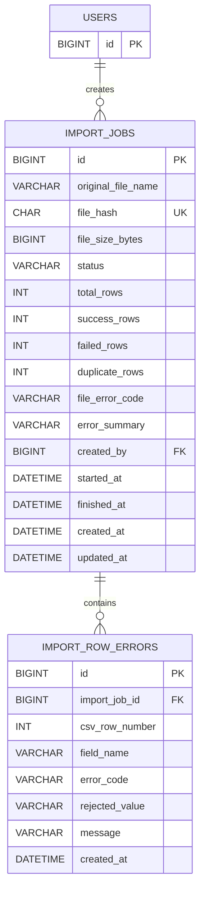

# Week 3 Day 2：导入任务数据模型与持久层设计

## 1. 业务目标与范围

Day 2 为后续 CSV 导入建立两类持久化记录：

- `import_jobs` 是一次被系统接受的文件处理任务，保存文件身份、处理状态、统计和文件级失败摘要。
- `import_row_errors` 是某个任务下可分页查询的行级错误明细，不保存整条原始 CSV。

本阶段的数据流只有：

```text
测试或后续 Service
  → ImportJobMapper / ImportRowErrorMapper
  → import_jobs / import_row_errors
  → 唯一约束、检查约束、外键和分页索引
```

Day 2 不实现上传接口、SHA-256 计算、CSV 解析、交易入库、状态流转 Service、RabbitMQ、Redis、自动对账、风险、审核或审计。

## 2. 关系模型



两个外键都采用 `ON DELETE RESTRICT`。第一版没有删除导入任务或行错误的接口，避免为了清理记录破坏“谁上传、处理结果和错误位置”的追踪链。

## 3. `import_jobs` 设计

| 字段 | 类型 | 空值 | 规则 |
|---|---|---:|---|
| `id` | `BIGINT` | 否 | 自增主键 |
| `original_file_name` | `VARCHAR(255)` | 否 | 保存客户端原文件名，不保存服务器路径 |
| `file_hash` | `CHAR(64)` ASCII binary | 否 | 64 位小写十六进制 SHA-256；全表唯一 |
| `file_size_bytes` | `BIGINT UNSIGNED` | 否 | `1～5,242,880` 字节 |
| `status` | `VARCHAR(32)` | 否 | 五种 `ImportJobStatus` |
| `total_rows` | `INT UNSIGNED` | 否 | 默认 0 |
| `success_rows` | `INT UNSIGNED` | 否 | 默认 0 |
| `failed_rows` | `INT UNSIGNED` | 否 | 默认 0 |
| `duplicate_rows` | `INT UNSIGNED` | 否 | 默认 0，且不能大于 `failed_rows` |
| `file_error_code` | `VARCHAR(32)` | 是 | 文件级或系统级失败码；只有 `FAILED` 可填写 |
| `error_summary` | `VARCHAR(255)` | 是 | 安全、简短的失败摘要 |
| `created_by` | `BIGINT` | 否 | 外键指向 `users.id` |
| `started_at` | `DATETIME(3)` | 是 | 后续进入 `PROCESSING` 时填写 |
| `finished_at` | `DATETIME(3)` | 是 | 后续进入终态时填写 |
| `created_at` | `DATETIME(3)` | 否 | 数据库生成 |
| `updated_at` | `DATETIME(3)` | 否 | 数据库自动维护 |

状态集合：

```text
PENDING
PROCESSING
SUCCESS
PARTIAL_SUCCESS
FAILED
```

文件错误码集合：

```text
INVALID_UTF8
INVALID_HEADER
MALFORMED_CSV
NO_DATA_ROWS
TOO_MANY_ROWS
PROCESSING_FAILED
```

静态数据库不变量：

- `file_hash` 格式合法且唯一，应用预查询不能代替唯一约束。
- 四项统计非负，`success_rows + failed_rows <= total_rows`。
- `duplicate_rows <= failed_rows`。
- 终态满足 `total_rows = success_rows + failed_rows`。
- 非 `FAILED` 状态不能保存 `file_error_code`。

状态跳转方向、时间填写和不同终态的业务组合由后续 Service 校验。Day 2 不用复杂 SQL 约束替代 Service 状态机，也不提前实现状态流转。

## 4. `import_row_errors` 设计

| 字段 | 类型 | 空值 | 规则 |
|---|---|---:|---|
| `id` | `BIGINT` | 否 | 自增主键和同一逻辑行内的稳定次序 |
| `import_job_id` | `BIGINT` | 否 | 外键指向 `import_jobs.id` |
| `csv_row_number` | `INT UNSIGNED` | 否 | 映射 Java `rowNumber`；CSV 第一条数据的逻辑记录号为 2 |
| `field_name` | `VARCHAR(64)` | 否 | 固定字段名或 `row` |
| `error_code` | `VARCHAR(64)` | 否 | 稳定的 `ImportRowErrorCode` |
| `rejected_value` | `VARCHAR(255)` | 是 | 只保存当前错误字段的安全截断值 |
| `message` | `VARCHAR(255)` | 否 | 不含 SQL、路径、堆栈或整条原始记录 |
| `created_at` | `DATETIME(3)` | 否 | 数据库生成 |

允许的字段名：

```text
row
account_no
external_transaction_no
direction
amount
transaction_time
description
```

行错误码完全沿用 Day 1 契约：

```text
COLUMN_COUNT_MISMATCH
INVALID_ACCOUNT_NO
ACCOUNT_NOT_FOUND
ACCOUNT_NOT_ACTIVE
INVALID_EXTERNAL_TRANSACTION_NO
INVALID_DIRECTION
INVALID_AMOUNT
INVALID_TRANSACTION_TIME
DESCRIPTION_TOO_LONG
DUPLICATE_TRANSACTION_IN_FILE
DUPLICATE_TRANSACTION
```

同一逻辑记录允许存在多个字段错误，因此不增加会阻止多错误记录的业务唯一约束。

## 5. 查询与索引

Day 2 只支持三个持久层查询：

1. `BaseMapper.selectById`：按任务 ID 查询。
2. `ImportJobMapper.findByFileHash`：重复上传时找到原任务；唯一索引同时覆盖该查询。
3. `ImportRowErrorMapper.selectPageByImportJobId`：按任务 ID 查询错误，固定 `csv_row_number ASC, id ASC`。

行错误索引为：

```text
(import_job_id, csv_row_number, id)
```

它先定位一个任务，再按接口要求的顺序返回记录。当前没有任务列表、按状态扫描或按创建人筛选接口，因此不提前增加相关索引。

## 6. Java 持久层

```text
importjob
├── entity
│   ├── ImportJob
│   └── ImportRowError
├── mapper
│   ├── ImportJobMapper
│   └── ImportRowErrorMapper
└── model
    ├── ImportFileErrorCode
    ├── ImportJobStatus
    └── ImportRowErrorCode
```

- Entity 只表达数据库字段，不包含上传文件、CSV 记录或状态流转逻辑。
- Mapper 只实现按哈希查询和错误稳定分页；不承担业务校验。
- 枚举名直接持久化为数据库字符串，Java 与数据库检查约束使用同一集合。

## 7. 测试与清理

聚焦集成测试覆盖：

- V4 表、唯一约束、检查约束、两个 `RESTRICT` 外键和联合索引；
- 五种状态、全部文件错误码和全部行错误码的往返持久化；
- 相同文件哈希并发兜底所依赖的唯一约束；
- 非法哈希、文件大小、状态、错误码、统计和外键被数据库拒绝；
- 按哈希找到原任务；
- 多条同一行错误可以共存；
- 错误分页跨页无重复、无遗漏，顺序为 `csv_row_number ASC, id ASC`；
- 删除被任务引用的用户或被错误引用的任务时受到限制。

测试数据使用独立前缀，按下面的顺序清理：

```text
import_row_errors
→ import_jobs
→ user_roles
→ users
```

Flyway 固定角色 `ADMIN`、`REVIEWER` 不属于 Day 2 测试数据，不能删除。

## 8. 验收边界

完成 Day 2 必须证明：

- 空数据卷可以从 V1 顺序迁移到 V4；
- 当前业务表由 5 张增加为 7 张，V1～V3 不被修改；
- 聚焦测试和完整 `mvn clean test` 通过且无跳过；
- 真实 MySQL 元数据与查询计划证明约束、外键和分页索引生效；
- 测试数据、临时进程和端口已清理；
- Git 变更中没有上传、解析、交易写入、Service、Controller、MQ、Redis 或对账实现。
